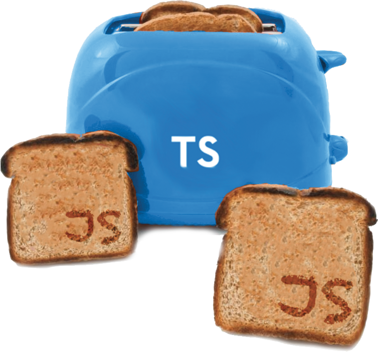
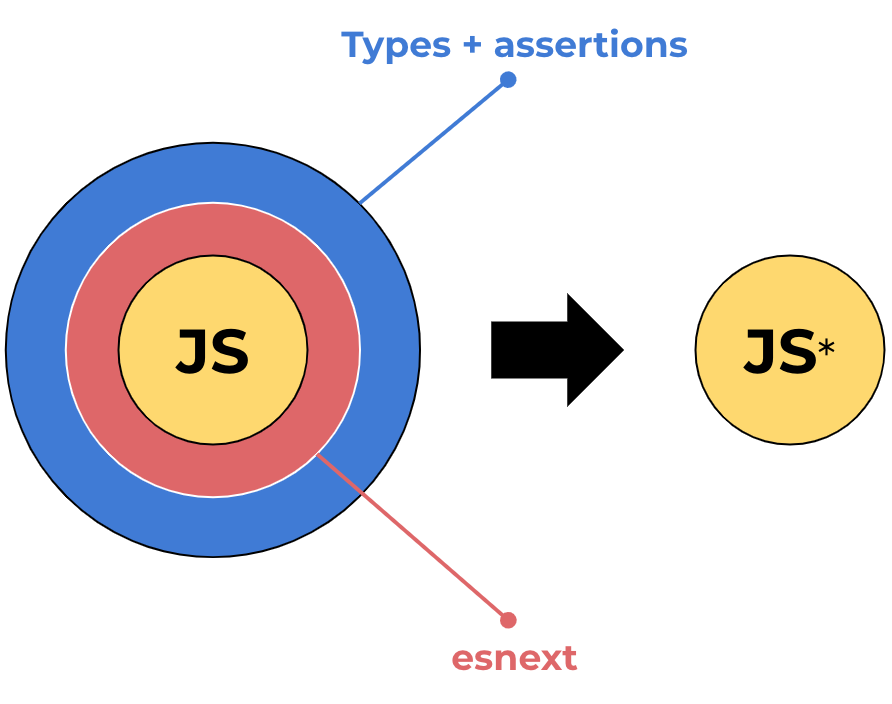

# Workshop: Introducción a TypeScript 💙

 

[Typescript](http://www.typescriptlang.org/) (TS) es un lenguaje de programación Open Source desarrollado por Microsoft publicado por primera vez en 2012. Es un **superconjunto** de Javascript, que extiende su sintaxis agregando **tipado estatico** y la posibilidad de usar nuevas features aún no disponibles en los engines de JS. Los archivos escritos en TS que son procesados por el compilador generan archivos en JS convencional.

En la figura se puede observar el caracter de superconjunto de TypeScript, y como "envuelve" las funcionalidades disponibles en JavaScript y las nuevas versiones del estandar ECMAScript.

 

En el [Roadmap de TypeScript](https://github.com/microsoft/TypeScript/wiki/Roadmap) se encuentra disponible el listado de funcionalidades lanzadas (junto con un link a su descripción en detalle) y las nuevas funcionalidades a implementar.

## Requisitos

* Base solida de JavaScript.
* Conocimiento en las últimas funcionalidades introducidas en [ES2016](https://javascriptplayground.com/es2016-and-beyond/).

## Materiales

- [Repositorio proyecto](www.google.com).
- [Presentación](www.google.com).

## Temas

1. 🔰 [Tipado básico en TypeScript](/lessons/1-basics.ts).
2. 🧮 [Funciones](/lessons/2-functions.ts).
3. 📜 [Interfaces](/lessons/3-interfaces.ts).
4. 🎩 [Clases](/lessons/4-classes.ts).
5. 📦 [Tipos genericos](/lessons/5-generics.ts).
5. 📦 [Guardas de tipos](/lessons/6-guards.ts).

## Licencia

Este proyecto es desarrollado y mantenido por [Emanuel Casco](https://github.com/emanuelcasco).

**workshop-typescript** is available under the MIT [license](LICENSE.md).

    Copyright (c) 2019 Emanuel Casco

    Permission is hereby granted, free of charge, to any person obtaining a copy
    of this software and associated documentation files (the "Software"), to deal
    in the Software without restriction, including without limitation the rights
    to use, copy, modify, merge, publish, distribute, sublicense, and/or sell
    copies of the Software, and to permit persons to whom the Software is
    furnished to do so, subject to the following conditions:

    The above copyright notice and this permission notice shall be included in
    all copies or substantial portions of the Software.

    THE SOFTWARE IS PROVIDED "AS IS", WITHOUT WARRANTY OF ANY KIND, EXPRESS OR
    IMPLIED, INCLUDING BUT NOT LIMITED TO THE WARRANTIES OF MERCHANTABILITY,
    FITNESS FOR A PARTICULAR PURPOSE AND NONINFRINGEMENT. IN NO EVENT SHALL THE
    AUTHORS OR COPYRIGHT HOLDERS BE LIABLE FOR ANY CLAIM, DAMAGES OR OTHER
    LIABILITY, WHETHER IN AN ACTION OF CONTRACT, TORT OR OTHERWISE, ARISING FROM,
    OUT OF OR IN CONNECTION WITH THE SOFTWARE OR THE USE OR OTHER DEALINGS IN
    THE SOFTWARE.
